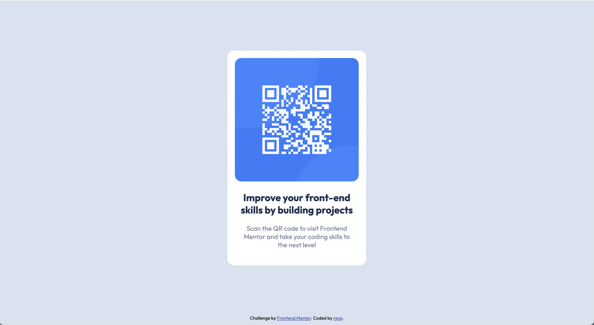

# Frontend Mentor - QR code component solution

This is a solution to the [QR code component challenge on Frontend Mentor](https://www.frontendmentor.io/challenges/qr-code-component-iux_sIO_H). Frontend Mentor challenges help you improve your coding skills by building realistic projects. 

## Table of contents

- [Overview](#overview)
  - [Screenshot](#screenshot)
  - [Links](#links)
- [My process](#my-process)
  - [Built with](#built-with)
  - [What I learned](#what-i-learned)
  - [Continued development](#continued-development)
  - [Useful resources](#useful-resources)

## Overview

### Screenshot

### Links

- Solution URL: https://github.com/racelo/qr-code-repo
- Live Site URL: https://racelo.github.io/qr-code-repo/

## My process

### Built with

- Semantic HTML5 markup
- CSS custom properties
- Flexbox
- Mobile-first workflow

### What I learned

I used Flexbox in this project to make the page responsive but most importantly, to be able to stick the footnote at the bottom of the page. I learned that there are many ways to do this and the most simple one is by setting the margin-top of the footnote to auto. Since I need the main content of my page to be centered, this solution did not work for me. What I did instead was to set the margin of my main content to auto. 

### Continued development

Subjects to focus on:
- CSS box-model
- Relearn the basics of Flexbox
- Learn more about responsive design

### Useful resources

- https://www.freecodecamp.org/news/css-media-queries-breakpoints-media-types-standard-resolutions-and-more/ - I find this article from freeCodeCamp really useful as it provides a quick overview of CSS media queries. 

## Author

- Frontend Mentor - [@racelo](https://www.frontendmentor.io/profile/racelo)
- Twitter - [@yourusername](https://www.twitter.com/_race05)